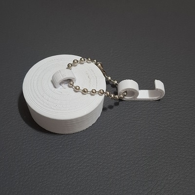
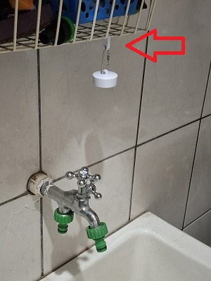
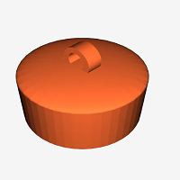
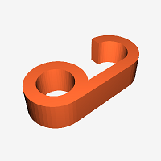

# 3d-drain-cork

**Replacement part for a water stopper / drain plug for a 35 mm drain outlet size.**

## Description

This item is a 35mm drain cover, designed for use in kitchen sinks or washing tank. Additionally, it features a hook for easy hanging. I personally used a little stainless steel chain, but it can also be secured using a zip tie or a cord.

I printed it in PLA, achieving excellent results. I had to include a raft to print the hook because, being a small piece, it detached easily from the print bed.

## Pictures




## Files

 "drain-cork.stl"
 "hook.sql"

## Tags

```hook``` ```sink``` ```drain``` ```cork``` ```sinkplug```

## Model origin

The author marked this model as their own original creation.

## License

Creative Commons LicenseThis work is licensed under a [Creative Commons (International License)](https://creativecommons.org/share-your-work/public-domain/cc0/)


- :heavy_check_mark: Sharing without ATTRIBUTION
- :heavy_check_mark: Remix Culture allowed
- :heavy_check_mark: Commercial Use
- :heavy_check_mark: Free Cultural Works
- :heavy_check_mark: Meets Open Definition

## Files


